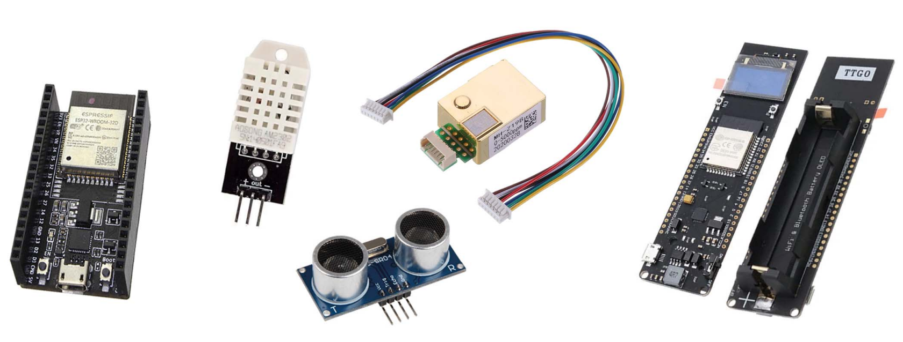

## Project Description
The objective of this project is to design and implement a monitoring and display system for a few environmental parameters: Temperature, humidity, CO2. The display can be done in two ways, either using a 0.96" OLED screen or on a dedicated web page for broadcasting this information.

The system consists of 3 sensors indicated in Table \ref{tab:capt}, and two ESP32 microcontrollers, one of which is equipped with a 0.96" OLED screen.

| Sensor Name | Description                           |
|-------------|---------------------------------------|
| DHT22       | Temperature and humidity sensor       |
| MH-ZB19     | CO2 sensor                            |
| HCSR04      | Ultrasonic distance sensor            |

